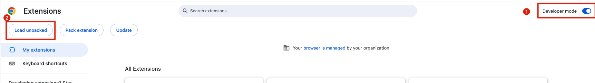
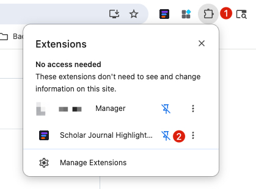
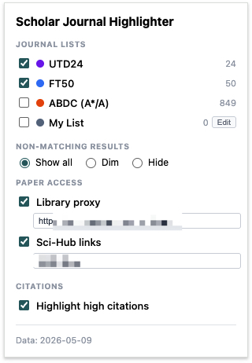
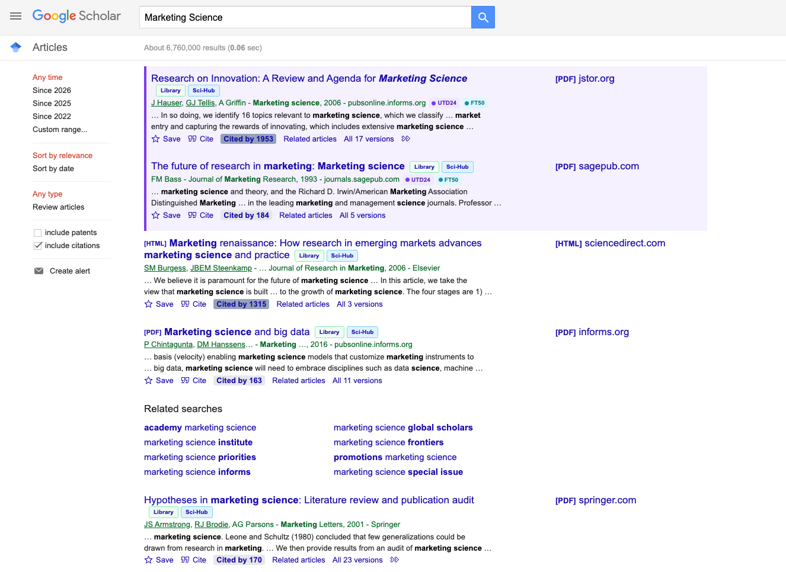
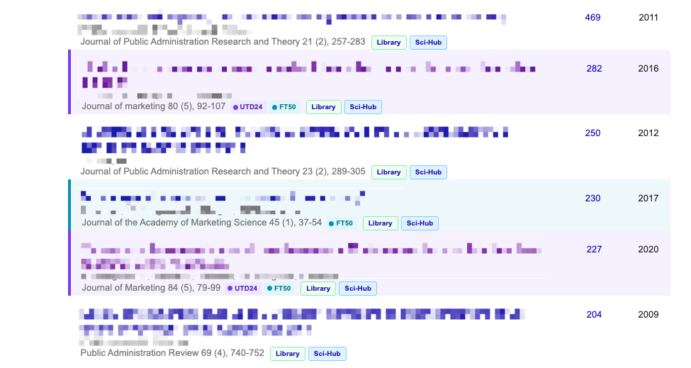

# Scholar Journal Highlighter

A Chrome extension for business school students and researchers. Highlights top-tier journals on Google Scholar so you can quickly spot quality publications when searching for papers, checking citations, or browsing author profiles.

Focuses on UTD24, FT50, and ABDC (A\*/A only) -- the journal lists that matter for business research.

## Important: About Sci-Hub

This extension includes an optional Sci-Hub integration for convenience. **Sci-Hub is not endorsed or recommended for bypassing publisher paywalls.** Accessing copyrighted articles without authorization may violate copyright law in your jurisdiction. We strongly encourage you to use your university's library proxy to access papers through legitimate institutional subscriptions. The Sci-Hub feature is **disabled by default** and provided only for users who understand and accept the associated risks.

## Features

### Journal Highlighting

- Matching journals appear with colored borders, background tints, and tier badges
- Independent toggle for each journal list
- Non-matching results: show all, dim, or hide
- Custom journal list with add/remove UI
- Alias matching for abbreviated journal names (e.g., "JMR" for Journal of Marketing Research)
- Fuzzy substring matching as fallback
- Auto-updates journal data from GitHub (7-day cache)
- Works on both search results and author profile pages
- Works with Google Scholar's infinite scroll

### Paper Access (v3.0+)

- **Library proxy** (recommended): adds a Library button that opens the paper through your institution's proxy (e.g., EZproxy, OpenAthens). Enter your proxy URL in settings -- works with any university.
- **Sci-Hub links** (optional): adds a Sci-Hub button next to each search result title. Uses DOI extraction from Google Scholar citation pages, with CrossRef API as fallback. Sci-Hub URL is user-configurable. See [disclaimer](#important-about-sci-hub).
- **Citation highlighting**: high-citation papers are visually emphasized (100+ green, 500+ blue, 1000+ purple).

## Supported Journal Lists

| List | Journals | Color | Source |
|---|---|---|---|
| UTD24 | 24 | Purple | UT Dallas top 24 business journals |
| FT50 | 50 | Teal | Financial Times top 50 journals |
| ABDC (A\*/A) | 849 | Amber | Australian Business Deans Council (A\* and A only) |
| My List | User-defined | Gray | Custom journals added via popup |

## Install

### Step 1: Download

Download the latest release zip from [Releases](../../releases) and unzip it to a folder on your computer.

### Step 2: Enable Developer Mode and Load

Go to `chrome://extensions/` in your browser. Turn on **Developer mode** (top-right corner, marked **1** below), then click **Load unpacked** (top-left, marked **2**) and select the unzipped extension folder.



### Step 3: Pin the Extension

Click the puzzle icon in the Chrome toolbar, then click the pin icon (marked **2** below) next to Scholar Journal Highlighter.



### Step 4: Configure Settings

Click the extension icon in your toolbar to open settings.



**Library proxy (recommended):** Enable "Library proxy" and enter your institution's EZproxy URL prefix. Example:
- `https://ezproxy.yourschool.edu/login?url=`

Note: Only EZproxy-style URL prefixes are supported. OpenAthens (SAML-based) authentication is not yet supported.

**Sci-Hub (optional):** Enable "Sci-Hub links" if you wish to use it. See the [disclaimer above](#important-about-sci-hub).

## What It Looks Like

### Search Results

Journal badges (UTD24, FT50), Library/Sci-Hub buttons, and citation highlighting on Google Scholar search results.



### Author Profile

Journal badges and access buttons on an author's Google Scholar profile page.



## Accessibility

Colors are designed to be distinguishable for users with color vision deficiency (1 in 12 men, 1 in 200 women in the US). All color-coded elements also carry text labels -- color is never the sole indicator.

- **Journal badges**: purple (UTD24), teal (FT50), amber (ABDC), gray (My List) -- avoids red-green and blue-purple confusion
- **Citation highlights**: luminance-based gray scale (light to dark) -- works for all colorblind types
- **All text meets WCAG AA contrast ratio** (4.5:1 minimum)

References:
- [Color Blindness - UNC School of Medicine](https://www.med.unc.edu/webguide/accessibility/color/)
- [Colour Blindness Awareness](https://www.colourblindawareness.org/colour-blindness/)
- [Types of Color Vision Deficiency - NEI](https://www.nei.nih.gov/eye-health-information/eye-conditions-and-diseases/color-blindness/types-color-vision-deficiency)
- [Color Blindness - Cleveland Clinic](https://my.clevelandclinic.org/health/diseases/11604-color-blindness)

## DOI Lookup

The extension extracts DOIs in two steps:
1. **Google Scholar citation page** -- parsed for publisher URLs containing DOIs (works for most papers, no external API needed)
2. **CrossRef API fallback** -- if step 1 finds no DOI, the [CrossRef API](https://api.crossref.org/) is queried by title. No API key required, 50 req/sec rate limit.

## Development

### Project Structure

```
extension/          Chrome extension source
  manifest.json     Extension manifest (v3)
  content.js        Injects highlighting + access buttons into Google Scholar
  background.js     Service worker for data fetching, DOI lookup (CrossRef), config
  popup.html/js/css  Settings popup UI
  journals.json     Bundled journal data (fallback)
  styles.css        Highlighting and button styles

data/               Journal source data and config
  utd24.json        UTD24 journal names
  ft50.json         FT50 journal names
  abdc.json         ABDC A*/A journals with ratings
  custom.json       Seed custom list (empty)
  journals.json     Merged build output
  config.json       Default Sci-Hub URL and proxy URL

scripts/            Build tools
  extract_abdc.py   Extract A*/A from ABDC xlsx
  build_journals.py Merge all lists into journals.json

docs/images/        Screenshots for README
```

### Updating Journal Data

**UTD24 or FT50** (rarely changes):
Edit `data/utd24.json` or `data/ft50.json` directly, then run the build.

**ABDC** (every 1-2 years):
1. Download the ABDC Journal Quality List xlsx from [abdc.edu.au](https://abdc.edu.au)
2. Rename to `ABDC-JQL-2025.xlsx` and place in `data/`
3. Run: `python scripts/extract_abdc.py`
4. Run: `python scripts/build_journals.py`

**Build merged data:**
```bash
python scripts/build_journals.py
```
This outputs to both `data/journals.json` and `extension/journals.json`.

**Auto-update for installed extensions:** The extension fetches journal data and config from this repo on GitHub (7-day cache). When you push updated data, all installed extensions pick up changes within 7 days -- no reinstall needed.

**Updating Sci-Hub URL:** Edit `data/config.json` and push. Users can also override the URL in the extension popup settings.

### Releasing

1. Update version in `extension/manifest.json`
2. Commit and push
3. Create a GitHub Release tagged `vX.Y.Z` with a zip of the `extension/` folder
